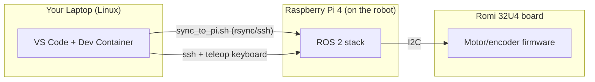

# Linux Setup Guide — ROMI-ROS2

Welcome! This guide walks you through everything you need to do, from a completely
fresh Linux computer, to driving your ROMI robot with the keyboard. It assumes
you have **never used Linux, Docker, VS Code, or ROS 2 before**, so it explains
things step by step. Take your time, read each step fully before running the
command, and don't skip ahead.

This guide is written for **Ubuntu** (the most common Linux distribution used
in the lab). If you are using a different distribution (Fedora, Arch, etc.),
the ideas are the same but the package-installation commands will differ —
ask your instructor for help adapting them.

> **What is a terminal?** The terminal (also called a "shell" or "console") is
> a text-based window where you type commands instead of clicking buttons. You
> can usually open it by pressing <kbd>Ctrl</kbd>+<kbd>Alt</kbd>+<kbd>T</kbd>,
> or by searching for "Terminal" in your applications menu. Every gray code
> block below with a `$` prompt is meant to be typed (or copy-pasted) into a
> terminal, one line at a time, followed by <kbd>Enter</kbd>.

## What you will build



- Your **laptop** runs a Docker container with ROS 2 Humble installed. You
  will write/build code and drive the robot from here.
- The **Raspberry Pi**, mounted on the robot, runs the same ROS 2 software and
  talks to the motor controller.
- The **Romi 32U4 board** runs a small Arduino firmware that handles motors,
  encoders, and the IMU sensor, and talks to the Pi over I2C.

## Table of Contents

1. [Prerequisites](#1-prerequisites)
2. [Install Docker](#2-install-docker)
3. [Install VS Code](#3-install-vs-code)
4. [Install the Dev Containers extension](#4-install-the-dev-containers-extension)
5. [Flash the ROMI 32U4 firmware](#5-flash-the-romi-32u4-firmware)
6. [Flash the Raspberry Pi image](#6-flash-the-raspberry-pi-image)
7. [Clone the repository and open the Dev Container](#7-clone-the-repository-and-open-the-dev-container)
8. [Build the workspace inside the container](#8-build-the-workspace-inside-the-container)
9. [Sync the workspace to the Raspberry Pi](#9-sync-the-workspace-to-the-raspberry-pi)
10. [Verify everything works](#10-verify-everything-works)
11. [Troubleshooting](#11-troubleshooting)

---

## 1) Prerequisites

Hardware you should have in front of you:

- A laptop or desktop running Ubuntu Linux (or similar), with an available
  USB port and Wi-Fi.
- A Pololu ROMI robot with a Romi 32U4 control board, a Raspberry Pi 4 already
  mounted on it, and a microSD card (32 GB or larger).
- A USB cable to connect the Romi 32U4 board to your laptop (for flashing
  firmware).
- A microSD card reader (built-in or USB) for flashing the Pi image.

You will need administrator (`sudo`) rights on your laptop to install
software.

## 2) Install Docker

Docker lets us run a ready-made Linux environment (a "container") with ROS 2
Humble pre-installed, without messing up your host computer's own software.

1. Remove any very old Docker packages that might conflict (safe to run even
   if nothing is installed — errors here are fine):

   ```bash
   for pkg in docker.io docker-doc docker-compose podman-docker containerd runc; do sudo apt-get remove -y $pkg; done
   ```

2. Update your package list and install prerequisites:

   ```bash
   sudo apt-get update
   sudo apt-get install -y ca-certificates curl
   ```

3. Add Docker's official GPG key:

   ```bash
   sudo install -m 0755 -d /etc/apt/keyrings
   sudo curl -fsSL https://download.docker.com/linux/ubuntu/gpg -o /etc/apt/keyrings/docker.asc
   sudo chmod a+r /etc/apt/keyrings/docker.asc
   ```

4. Add the Docker repository to your package sources:

   ```bash
   echo \
     "deb [arch=$(dpkg --print-architecture) signed-by=/etc/apt/keyrings/docker.asc] https://download.docker.com/linux/ubuntu \
     $(. /etc/os-release && echo "$VERSION_CODENAME") stable" | \
     sudo tee /etc/apt/sources.list.d/docker.list > /dev/null
   sudo apt-get update
   ```

5. Install Docker Engine:

   ```bash
   sudo apt-get install -y docker-ce docker-ce-cli containerd.io docker-buildx-plugin docker-compose-plugin
   ```

6. Let your user run Docker without typing `sudo` every time:

   ```bash
   sudo usermod -aG docker $USER
   ```

   **Log out and log back in** (or reboot) for this to take effect.

7. Verify Docker works:

   ```bash
   docker run hello-world
   ```

   You should see a message starting with "Hello from Docker!". If you see a
   permission error instead, you likely forgot to log out/in after step 6.

> **Reference:** [Docker's official install guide](https://docs.docker.com/engine/install/ubuntu/)
> has the same steps if you want more detail.

## 3) Install VS Code

VS Code is the code editor we will use, including its "Dev Containers"
feature which lets us develop *inside* the Docker container from step 2.

1. Install the Microsoft GPG key and repository:

   ```bash
   sudo apt-get install -y wget gpg
   wget -qO- https://packages.microsoft.com/keys/microsoft.asc | gpg --dearmor > packages.microsoft.gpg
   sudo install -D -o root -g root -m 644 packages.microsoft.gpg /etc/apt/keyrings/packages.microsoft.gpg
   echo "deb [arch=amd64,arm64,armhf signed-by=/etc/apt/keyrings/packages.microsoft.gpg] https://packages.microsoft.com/repos/code stable main" | sudo tee /etc/apt/sources.list.d/vscode.list > /dev/null
   rm -f packages.microsoft.gpg
   ```

2. Install VS Code:

   ```bash
   sudo apt-get update
   sudo apt-get install -y code
   ```

3. Launch it once to confirm it opens:

   ```bash
   code
   ```

## 4) Install the Dev Containers extension

1. In VS Code, click the **Extensions** icon in the left sidebar (it looks
   like four squares), or press <kbd>Ctrl</kbd>+<kbd>Shift</kbd>+<kbd>X</kbd>.
2. Search for **Dev Containers** (published by Microsoft).
3. Click **Install**.

You now have everything installed. Next we'll flash the two pieces of
hardware (the Romi board and the Pi's SD card) before touching any ROS 2
code.

## 5) Flash the ROMI 32U4 firmware

This step programs the small microcontroller on the Romi chassis so it can
drive the motors and read encoders/IMU when commanded by the Raspberry Pi.
You only need to do this once per robot (unless the firmware is later
updated by your instructor).

1. Download and install the [Arduino IDE](https://www.arduino.cc/en/software)
   (choose the Linux AppImage or the `.deb` package for your distro).
2. Open the Arduino IDE. Go to **File → Preferences**. In the "Additional
   boards manager URLs" field, paste:

   ```
   https://files.pololu.com/arduino/package_pololu_index.json
   ```

   Click **OK**.
3. Go to **Tools → Board → Boards Manager**. Search for `Pololu` and install
   **Pololu A-Star Boards**.
4. Go to **Sketch → Include Library → Manage Libraries**. Search for
   `Romi32U4` and install it.
   > **Do not** install the `LSM6` library, and do not add
   > `#include <Wire.h>` or `#include <LSM6.h>` to the sketch. The firmware's
   > I2C-slave library and the standard `Wire` library both need the same
   > hardware interrupt, so combining them will fail to compile. The IMU is
   > read separately, directly by the Raspberry Pi.
5. Connect the Romi 32U4 board to your laptop with the USB cable. Power on
   the robot if it has a separate power switch.
6. In the Arduino IDE, go to **Tools → Board** and select the Romi 32U4 (or
   A-Star 32U4) board. Go to **Tools → Port** and select the serial port that
   appeared when you plugged in the USB cable (something like
   `/dev/ttyACM0`).
7. In VS Code or your file manager, open this file from the cloned repo (or
   download it directly if you haven't cloned yet):
   `lab_assets/arduino/RomiRPiSlaveDemo/RomiRPiSlaveDemo.ino`
   File → Open in the Arduino IDE also works.
8. Click the **Upload** button (the right-pointing arrow icon). Wait for
   "Done uploading" at the bottom of the window.

If the upload fails, see [Troubleshooting](#11-troubleshooting).

## 6) Flash the Raspberry Pi image

This step writes a ready-made ROS 2 operating system image onto the Pi's
microSD card, so you don't have to install Ubuntu and ROS 2 by hand.

1. Download the Pi image from the project's GitHub release:
   [romiPi20260723.img.xz](https://github.com/UNCC-Embedded-Lab/ROMI-ROS2/releases/download/pi-image/romiPi20260723.img.xz)

   This is a large file (multiple gigabytes); it may take a while depending
   on your internet connection.
2. Install the Raspberry Pi Imager tool:

   ```bash
   sudo snap install rpi-imager
   ```

   (If `snap` isn't available on your system, download the `.deb` from the
   [Raspberry Pi software page](https://www.raspberrypi.com/software/)
   instead.)
3. Insert the microSD card into your laptop's card reader.
4. Open **Raspberry Pi Imager**.
5. Click **Choose OS → Use custom**, then select the `romiPi20260723.img.xz`
   file you downloaded.
6. Click **Choose Storage** and select your microSD card.
   > **Double-check you selected the correct drive.** Flashing erases
   > everything on the selected storage device.
7. Click **Write** (or "Save"/"Next", depending on the Imager version) and
   confirm. This will take several minutes.
8. When it finishes, eject the card, insert it into the Raspberry Pi on the
   robot, and power the robot on.
9. Wait about a minute for the Pi to boot. The robot broadcasts its own
   Wi-Fi network named something like `Romi-XXXXXX` (a unique ID per robot).
   Connect your laptop's Wi-Fi to that network.
10. Verify you can reach the robot over SSH (default credentials are printed
    in the main [README.md](../README.md#prepare-raspberry-pi)):

    ```bash
    ssh student@192.168.4.1
    ```

    Type `yes` if asked about the host's fingerprint, then enter the
    password. If you get a shell prompt on the Pi, this step succeeded. Type
    `exit` to return to your laptop.

## 7) Clone the repository and open the Dev Container

1. Choose (or create) a folder on your laptop to hold your projects, e.g.:

   ```bash
   mkdir -p ~/ros2_ws/src
   cd ~/ros2_ws/src
   ```

2. Clone this repository:

   ```bash
   git clone https://github.com/UNCC-Embedded-Lab/ROMI-ROS2
   ```

   If `git` isn't installed, run `sudo apt-get install -y git` first.
3. Open the cloned folder in VS Code:

   ```bash
   code ~/ros2_ws/src/ROMI-ROS2
   ```

4. VS Code should pop up a notification in the bottom-right corner saying
   *"Folder contains a Dev Container configuration file..."*. Click
   **Reopen in Container**.

   If you don't see the notification, open the Command Palette with
   <kbd>Ctrl</kbd>+<kbd>Shift</kbd>+<kbd>P</kbd>, type `Dev Containers:
   Reopen in Container`, and press <kbd>Enter</kbd>.
5. The first time you do this, VS Code will download the ROS 2 Humble base
   image and start the container — this can take several minutes depending
   on your internet connection. Subsequent times will be much faster since
   the image and container are reused.
6. Once it finishes, open a new terminal inside VS Code with
   **Terminal → New Terminal**. Your prompt should now show you are inside
   the container (e.g. `root@<container-id>:/root/ros2_ws/src/ROMI-ROS2#`).

> More background on this container setup is in
> [DOCKER_LAUNCH.md](../DOCKER_LAUNCH.md), including how to reconnect to the
> same persistent container later without rebuilding it.

## 8) Build the workspace inside the container

All remaining commands in this section are typed **inside the VS Code
terminal that is connected to the container** (from step 7.6 above), not your
regular laptop terminal.

1. Move to the workspace root (one level above the cloned repo):

   ```bash
   cd /root/ros2_ws
   ```

2. Load the ROS 2 environment and build:

   ```bash
   source /opt/ros/humble/setup.bash
   colcon build --symlink-install
   ```

   This will take a few minutes the first time. Watch for `Summary: N
   packages finished` with no `Aborted` lines.
3. Load your newly built workspace:

   ```bash
   source install/setup.bash
   ```

   You'll need to re-run this `source` command (or open a new terminal, which
   does it automatically for the ROS setup) each time you open a new
   terminal in the container.

## 9) Sync the workspace to the Raspberry Pi

Your Pi needs its own copy of this source code, built for itself (the Pi's
processor is different from your laptop's).

1. Make sure your laptop is still connected to the robot's `Romi-XXXXXX`
   Wi-Fi network from step 6.
2. In the container terminal:

   ```bash
   cd /root/ros2_ws/src/ROMI-ROS2
   ./scripts/sync_to_pi.sh
   ```

3. This script copies the source code to the Pi over the network, then
   builds it there automatically. You may be prompted for the SSH password
   (default `romi32u4`, see [README.md](../README.md#prepare-raspberry-pi)).
   Watch for the `Build summary:` printed at the end — it should say
   `romi_base: success`.

   > If you need to pass a different host/user, run
   > `./scripts/sync_to_pi.sh --help` to see all the options.

## 10) Verify everything works

Now let's confirm the whole pipeline is working end to end.

1. From your container terminal, launch the full robot software stack on the
   Pi ("bringup"). The easiest way is the helper script, which SSHes in for
   you:

   ```bash
   cd /root/ros2_ws/src/ROMI-ROS2
   ./scripts/run_robot.sh
   ```

   This runs `romi_robot.launch.py` on the Pi and streams its output back to
   your terminal. Leave this terminal open and running.

   > Equivalent manual version, if you prefer to SSH in yourself:
   > `ssh student@192.168.4.1` then
   > `source /opt/ros/humble/setup.bash && source ~/ros2_ws/install/setup.bash && ros2 launch romi_base romi_robot.launch.py`

2. Open a **second** VS Code terminal (still inside the container: **Terminal
   → New Terminal**). Make sure the ROS 2 environment is sourced (new
   terminals do this automatically via `.bashrc`), then start keyboard
   teleop:

   ```bash
   ros2 run teleop_twist_keyboard teleop_twist_keyboard
   ```

3. Follow the on-screen key legend (typically <kbd>i</kbd>/<kbd>,</kbd> to go
   forward/backward, <kbd>j</kbd>/<kbd>l</kbd> to turn, <kbd>k</kbd> to stop).
   Give the robot a little clearance and try driving it forward, backward,
   and turning.
4. If the wheels move in response to your keypresses, **congratulations —
   your setup is complete!** Press <kbd>Ctrl</kbd>+<kbd>C</kbd> in the teleop
   terminal to stop sending commands, then <kbd>Ctrl</kbd>+<kbd>C</kbd> in
   the first terminal to shut the robot stack down cleanly.

## 11) Troubleshooting

- **`docker run hello-world` fails with a permission error** — you likely
  didn't log out/in after `usermod -aG docker $USER`. Fully log out of your
  Linux session (or reboot) and try again.
- **Arduino IDE doesn't list a serial port** — try a different USB cable
  (some are "charge-only" and carry no data), a different USB port, and make
  sure the robot is powered on.
- **Upload to the Romi board fails** — double-check you selected the correct
  board and port under the **Tools** menu, and that no other program (like a
  serial monitor) is holding the port open.
- **Can't SSH to `192.168.4.1`** — make sure your laptop's Wi-Fi is connected
  to the robot's own `Romi-XXXXXX` network, not your home/campus Wi-Fi. Also
  give the Pi a minute or two after power-on to finish booting.
- **`sync_to_pi.sh` fails with "Missing required command"** — install the
  missing tool inside the container with
  `apt-get update && apt-get install -y openssh-client rsync`.
- **Robot's clock seems off / TF or timestamp errors in ROS** — run
  `./scripts/sync_pi_clock.sh` from the container to push your laptop's clock
  onto the Pi, then relaunch the robot stack.
- **"Reopen in Container" doesn't appear** — make sure you opened the
  `ROMI-ROS2` folder itself in VS Code (not a parent or child folder), and
  that the Dev Containers extension is installed and enabled.
- Still stuck? Re-read the step slowly, check for typos, and ask your
  instructor or TA — include the exact error message you're seeing.

Once you're comfortable with this basic flow, see the main
[README.md](../README.md) for the full set of launch files, simulation, and
navigation/AMCL instructions.
