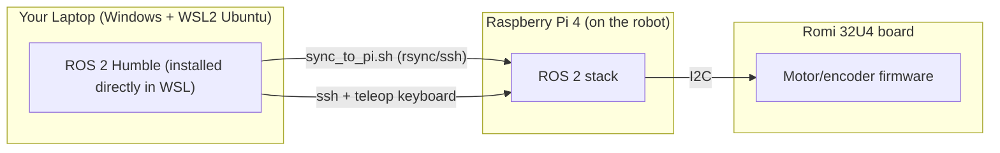

# Windows Setup Guide — ROMI-ROS2

Welcome! This guide walks you through everything you need to do, from a
completely fresh Windows computer, to driving your ROMI robot with the
keyboard. It assumes you have **never used Windows Subsystem for Linux
(WSL), Linux, or ROS 2 before**, so it explains things step by step. Take
your time, read each step fully before running the command, and don't skip
ahead.

Unlike the Linux guide, we will **not** use Docker or a dev container here.
Instead, we install Ubuntu 22.04 directly inside WSL2 and install ROS 2
Humble on it, which keeps things simpler on Windows.

> **What is WSL?** Windows Subsystem for Linux lets you run a real Ubuntu
> Linux environment side-by-side with Windows, without a separate computer
> or a traditional virtual machine. You'll open an "Ubuntu" terminal window
> and type Linux commands into it, just like a Linux user would.
>
> **What is a terminal?** A text-based window where you type commands
> instead of clicking buttons. Every gray code block below with a `$` prompt
> is meant to be typed (or copy-pasted) into a terminal, one line at a time,
> followed by <kbd>Enter</kbd>. Blocks with a `>` prompt (PowerShell) should
> be run in **Windows PowerShell**, not inside Ubuntu — the instructions
> below tell you which is which.

## What you will build



- Your **laptop** runs Ubuntu 22.04 inside WSL2, with ROS 2 Humble installed
  directly (no container). You will write/build code and drive the robot
  from here.
- The **Raspberry Pi**, mounted on the robot, runs the same ROS 2 software
  and talks to the motor controller.
- The **Romi 32U4 board** runs a small Arduino firmware that handles motors,
  encoders, and the IMU sensor, and talks to the Pi over I2C.

## Table of Contents

1. [Prerequisites](#1-prerequisites)
2. [Install WSL2 with Ubuntu 22.04](#2-install-wsl2-with-ubuntu-2204)
3. [Install ROS 2 Humble inside WSL](#3-install-ros-2-humble-inside-wsl)
4. [(Optional) Install VS Code with the WSL extension](#4-optional-install-vs-code-with-the-wsl-extension)
5. [Flash the ROMI 32U4 firmware](#5-flash-the-romi-32u4-firmware)
6. [Flash the Raspberry Pi image](#6-flash-the-raspberry-pi-image)
7. [Clone the repository and build the workspace](#7-clone-the-repository-and-build-the-workspace)
8. [Sync the workspace to the Raspberry Pi](#8-sync-the-workspace-to-the-raspberry-pi)
9. [Verify everything works](#9-verify-everything-works)
10. [Troubleshooting](#10-troubleshooting)

---

## 1) Prerequisites

Hardware you should have in front of you:

- A laptop or desktop running **Windows 10 (version 2004+) or Windows 11**,
  with an available USB port and Wi-Fi.
- A Pololu ROMI robot with a Romi 32U4 control board, a Raspberry Pi 4 already
  mounted on it, and a microSD card (32 GB or larger).
- A USB cable to connect the Romi 32U4 board to your laptop (for flashing
  firmware).
- A microSD card reader (built-in or USB) for flashing the Pi image.

You will need administrator rights on your laptop to enable WSL and install
software.

## 2) Install WSL2 with Ubuntu 22.04

1. Open **PowerShell as Administrator**: click Start, type `PowerShell`,
   right-click **Windows PowerShell**, and choose **Run as administrator**.
2. Install WSL with Ubuntu 22.04:

   ```powershell
   wsl --install -d Ubuntu-22.04
   ```

   This enables the required Windows features, downloads WSL2, and installs
   Ubuntu 22.04. It may take several minutes and will likely ask you to
   **reboot your computer** partway through — go ahead and reboot, then
   continue below.

   > If you get an error that virtualization is not enabled, you may need to
   > enable "Virtualization Technology" (sometimes called VT-x/AMD-V) in your
   > computer's BIOS/UEFI settings. Search your laptop model + "enable
   > virtualization BIOS" for instructions, since the exact menu varies by
   > manufacturer.
3. After rebooting, Ubuntu should launch automatically and finish installing.
   If it doesn't, open the **Ubuntu 22.04** app from the Start menu.
4. The first time it runs, Ubuntu will ask you to create a **UNIX username
   and password**. This is separate from your Windows login — pick something
   simple and memorable (you'll type the password again for any `sudo`
   command). Note this password is not shown as you type it — that's normal.
5. Verify you're in Ubuntu 22.04 by running (inside the Ubuntu terminal
   window):

   ```bash
   lsb_release -a
   ```

   You should see `Ubuntu 22.04` in the output.
6. Update the system:

   ```bash
   sudo apt update && sudo apt upgrade -y
   ```

From this point on, unless a step explicitly says "PowerShell" or "on
Windows", **all commands are run inside this Ubuntu terminal window**. You
can reopen it any time from the Start menu ("Ubuntu 22.04") or by typing
`wsl` in PowerShell.

## 3) Install ROS 2 Humble inside WSL

These steps mirror the [official ROS 2 Humble installation
guide](https://docs.ros.org/en/humble/Installation/Ubuntu-Install-Debs.html)
for Ubuntu 22.04. Run all of these inside your Ubuntu terminal.

1. Make sure your locale supports UTF-8 (it should by default on a fresh
   install, but let's be sure):

   ```bash
   sudo apt update && sudo apt install -y locales
   sudo locale-gen en_US en_US.UTF-8
   sudo update-locale LC_ALL=en_US.UTF-8 LANG=en_US.UTF-8
   export LANG=en_US.UTF-8
   ```

2. Make sure the Ubuntu Universe repository is enabled:

   ```bash
   sudo apt install -y software-properties-common
   sudo add-apt-repository universe
   ```

3. Add the ROS 2 apt repository:

   ```bash
   sudo apt update && sudo apt install -y curl
   export ROS_APT_SOURCE_VERSION=$(curl -s https://api.github.com/repos/ros-infrastructure/ros-apt-source/releases/latest | grep -F "tag_name" | awk -F\" '{print $4}')
   curl -L -o /tmp/ros2-apt-source.deb \
     "https://github.com/ros-infrastructure/ros-apt-source/releases/download/${ROS_APT_SOURCE_VERSION}/ros2-apt-source_${ROS_APT_SOURCE_VERSION}.$(. /etc/os-release && echo ${UBUNTU_CODENAME:-${VERSION_CODENAME}})_all.deb"
   sudo dpkg -i /tmp/ros2-apt-source.deb
   ```

4. Update and install ROS 2 Desktop (includes RViz and demo tools, useful for
   visualization) plus development tools:

   ```bash
   sudo apt update && sudo apt upgrade -y
   sudo apt install -y ros-humble-desktop ros-dev-tools
   ```

   This step downloads a lot of software and can take a while — this is a
   good time to grab a coffee.
5. Install the extra packages this project needs that aren't part of the
   base desktop install:

   ```bash
   sudo apt install -y ros-humble-xacro ros-humble-teleop-twist-keyboard
   ```

6. Install `git`, `ssh`, and `rsync` (used to clone the repo and sync code to
   the Pi):

   ```bash
   sudo apt install -y git openssh-client rsync
   ```

7. Make ROS 2 load automatically in every new Ubuntu terminal:

   ```bash
   echo "source /opt/ros/humble/setup.bash" >> ~/.bashrc
   source ~/.bashrc
   ```

8. Quick sanity check — this should print version info with no errors:

   ```bash
   ros2 --version
   ```

## 4) (Optional) Install VS Code with the WSL extension

You don't strictly need an editor to complete this tutorial (you can use
`nano` from the terminal), but VS Code makes browsing and editing the code
much easier.

1. On the **Windows** side (not inside Ubuntu), download and install
   [VS Code](https://code.visualstudio.com/).
2. Open VS Code, go to the Extensions icon in the sidebar, search for
   **WSL** (published by Microsoft), and install it.
3. From your Ubuntu terminal, navigate to the folder you'll use later (it
   doesn't need to exist yet — we'll create it in step 7) and run:

   ```bash
   code .
   ```

   The first time, this installs a small VS Code server inside WSL and then
   opens a VS Code window on your Windows desktop that's connected to your
   Ubuntu files. You'll see "WSL: Ubuntu-22.04" in the bottom-left corner
   when it's connected correctly.

## 5) Flash the ROMI 32U4 firmware

This step programs the small microcontroller on the Romi chassis so it can
drive the motors and read encoders/IMU when commanded by the Raspberry Pi.
You only need to do this once per robot (unless the firmware is later
updated by your instructor).

We do this using the **native Windows** Arduino IDE (not inside WSL), because
USB devices aren't visible to WSL out of the box.

1. Download and install the [Arduino IDE for Windows](https://www.arduino.cc/en/software).
2. Open the Arduino IDE. Go to **File → Preferences**. In the "Additional
   boards manager URLs" field, paste:

   ```
   https://files.pololu.com/arduino/package_pololu_index.json
   ```

   Click **OK**.
3. Go to **Tools → Board → Boards Manager**. Search for `Pololu` and install
   **Pololu A-Star Boards**.
4. Go to **Sketch → Include Library → Manage Libraries**. Search for
   `Romi32U4` and install it.
   > **Do not** install the `LSM6` library, and do not add
   > `#include <Wire.h>` or `#include <LSM6.h>` to the sketch. The firmware's
   > I2C-slave library and the standard `Wire` library both need the same
   > hardware interrupt, so combining them will fail to compile. The IMU is
   > read separately, directly by the Raspberry Pi.
5. Connect the Romi 32U4 board to your laptop with the USB cable. Power on
   the robot if it has a separate power switch.
6. In the Arduino IDE, go to **Tools → Board** and select the Romi 32U4 (or
   A-Star 32U4) board. Go to **Tools → Port** and select the serial port that
   appeared when you plugged in the USB cable (something like `COM5`).
7. Download or locate this sketch file from the repository (you can browse
   it on GitHub before you've cloned anything locally):
   `lab_assets/arduino/RomiRPiSlaveDemo/RomiRPiSlaveDemo.ino`, and open it
   with **File → Open** in the Arduino IDE.
8. Click the **Upload** button (the right-pointing arrow icon). Wait for
   "Done uploading" at the bottom of the window.

If the upload fails, see [Troubleshooting](#10-troubleshooting).

## 6) Flash the Raspberry Pi image

This step writes a ready-made ROS 2 operating system image onto the Pi's
microSD card, so you don't have to install Ubuntu and ROS 2 on the Pi by
hand. We do this with the native Windows Raspberry Pi Imager app.

1. Download the Pi image from the project's GitHub release:
   [romiPi20260723.img.xz](https://github.com/UNCC-Embedded-Lab/ROMI-ROS2/releases/download/pi-image/romiPi20260723.img.xz)

   This is a large file (multiple gigabytes); it may take a while depending
   on your internet connection.
2. Download and install [Raspberry Pi Imager for Windows](https://www.raspberrypi.com/software/).
3. Insert the microSD card into your laptop's card reader.
4. Open **Raspberry Pi Imager**.
5. Click **Choose OS → Use custom**, then select the `romiPi20260723.img.xz`
   file you downloaded.
6. Click **Choose Storage** and select your microSD card.
   > **Double-check you selected the correct drive.** Flashing erases
   > everything on the selected storage device.
7. Click **Write** (or "Save"/"Next", depending on the Imager version) and
   confirm. This will take several minutes.
8. When it finishes, eject the card, insert it into the Raspberry Pi on the
   robot, and power the robot on.
9. Wait about a minute for the Pi to boot. The robot broadcasts its own
   Wi-Fi network named something like `Romi-XXXXXX` (a unique ID per robot).
   Connect your **Windows** Wi-Fi (not WSL — WSL shares your Windows network
   connection automatically) to that network.
10. Verify you can reach the robot over SSH. Back in your **Ubuntu (WSL)**
    terminal, default credentials are printed in the main
    [README.md](../README.md#prepare-raspberry-pi):

    ```bash
    ssh student@192.168.4.1
    ```

    Type `yes` if asked about the host's fingerprint, then enter the
    password. If you get a shell prompt on the Pi, this step succeeded. Type
    `exit` to return to your laptop.

    > If this doesn't connect, see the WSL networking note in
    > [Troubleshooting](#10-troubleshooting).

## 7) Clone the repository and build the workspace

All commands below are run in your **Ubuntu (WSL)** terminal.

1. Create a workspace folder and clone the repository:

   ```bash
   mkdir -p ~/ros2_ws/src
   cd ~/ros2_ws/src
   git clone https://github.com/UNCC-Embedded-Lab/ROMI-ROS2
   ```

2. Move to the workspace root and build:

   ```bash
   cd ~/ros2_ws
   source /opt/ros/humble/setup.bash
   colcon build --symlink-install
   ```

   This will take a few minutes the first time. Watch for `Summary: N
   packages finished` with no `Aborted` lines.
3. Load your newly built workspace:

   ```bash
   source install/setup.bash
   ```

   You'll need to re-run this `source` command each time you open a new
   Ubuntu terminal (the `source /opt/ros/humble/setup.bash` line you added
   to `~/.bashrc` in step 3 happens automatically, but this workspace overlay
   does not unless you add it too — see the tip below).

   > **Tip:** to save time, you can also add this to `~/.bashrc` so every new
   > terminal sources your workspace automatically:
   > ```bash
   > echo "[ -f ~/ros2_ws/install/setup.bash ] && source ~/ros2_ws/install/setup.bash" >> ~/.bashrc
   > ```

## 8) Sync the workspace to the Raspberry Pi

Your Pi needs its own copy of this source code, built for itself (the Pi's
processor is different from your laptop's).

1. Make sure your **Windows** Wi-Fi is still connected to the robot's
   `Romi-XXXXXX` network from step 6.
2. In your Ubuntu terminal:

   ```bash
   cd ~/ros2_ws/src/ROMI-ROS2
   ./scripts/sync_to_pi.sh
   ```

3. This script copies the source code to the Pi over the network, then
   builds it there automatically. You may be prompted for the SSH password
   (default `romi32u4`, see [README.md](../README.md#prepare-raspberry-pi)).
   Watch for the `Build summary:` printed at the end — it should say
   `romi_base: success`.

   > If you need to pass a different host/user, run
   > `./scripts/sync_to_pi.sh --help` to see all the options.

## 9) Verify everything works

Now let's confirm the whole pipeline is working end to end.

1. From your Ubuntu terminal, launch the full robot software stack on the
   Pi ("bringup"). The easiest way is the helper script, which SSHes in for
   you:

   ```bash
   cd ~/ros2_ws/src/ROMI-ROS2
   ./scripts/run_robot.sh
   ```

   This runs `romi_robot.launch.py` on the Pi and streams its output back to
   your terminal. Leave this terminal open and running.

   > Equivalent manual version, if you prefer to SSH in yourself:
   > `ssh student@192.168.4.1` then
   > `source /opt/ros/humble/setup.bash && source ~/ros2_ws/install/setup.bash && ros2 launch romi_base romi_robot.launch.py`

2. Open a **second** Ubuntu terminal window (from the Start menu, launch
   "Ubuntu 22.04" again, or right-click the taskbar icon and open a new
   window). Confirm the ROS 2 environment loads automatically, then start
   keyboard teleop:

   ```bash
   ros2 run teleop_twist_keyboard teleop_twist_keyboard
   ```

3. Follow the on-screen key legend (typically <kbd>i</kbd>/<kbd>,</kbd> to go
   forward/backward, <kbd>j</kbd>/<kbd>l</kbd> to turn, <kbd>k</kbd> to stop).
   Give the robot a little clearance and try driving it forward, backward,
   and turning.
4. If the wheels move in response to your keypresses, **congratulations —
   your setup is complete!** Press <kbd>Ctrl</kbd>+<kbd>C</kbd> in the teleop
   terminal to stop sending commands, then <kbd>Ctrl</kbd>+<kbd>C</kbd> in
   the first terminal to shut the robot stack down cleanly.

## 10) Troubleshooting

- **`wsl --install` says virtualization is not enabled** — enable
  "Virtualization Technology" (VT-x/AMD-V) in your BIOS/UEFI. Search your
  laptop model + "enable virtualization BIOS" for exact steps.
- **Arduino IDE doesn't list a serial port** — try a different USB cable
  (some are "charge-only" and carry no data), a different USB port, and make
  sure the robot is powered on.
- **Upload to the Romi board fails** — double-check you selected the correct
  board and port under the **Tools** menu, and that no other program (like a
  serial monitor) is holding the port open.
- **Can't SSH to `192.168.4.1` from WSL** — first confirm your **Windows**
  Wi-Fi (System Tray → Wi-Fi icon) is connected to the robot's own
  `Romi-XXXXXX` network, not your home/campus Wi-Fi. WSL2 normally shares
  your Windows network connection automatically, but if it still can't
  reach the Pi, try running `ssh student@192.168.4.1` from **PowerShell**
  instead (if OpenSSH Client is installed on Windows) to confirm whether the
  problem is Windows-side or WSL-side networking. On Windows 11 you can also
  enable "Mirrored" networking mode for WSL (see Microsoft's
  [WSL networking docs](https://learn.microsoft.com/en-us/windows/wsl/networking))
  if the default NAT mode has trouble reaching devices on your Wi-Fi network.
- **`sync_to_pi.sh` fails with "Missing required command"** — install the
  missing tool with `sudo apt install -y openssh-client rsync`.
- **Robot's clock seems off / TF or timestamp errors in ROS** — run
  `./scripts/sync_pi_clock.sh` to push your laptop's clock onto the Pi, then
  relaunch the robot stack.
- **`colcon build` isn't found** — make sure `ros-dev-tools` installed
  correctly in step 3 and that you ran `source /opt/ros/humble/setup.bash`
  in the current terminal.
- Still stuck? Re-read the step slowly, check for typos, and ask your
  instructor or TA — include the exact error message you're seeing.

Once you're comfortable with this basic flow, see the main
[README.md](../README.md) for the full set of launch files, simulation, and
navigation/AMCL instructions. Note that simulation and RViz require a
graphical display; on Windows 11 this generally works out of the box via
WSLg, but is not required for this tutorial.
